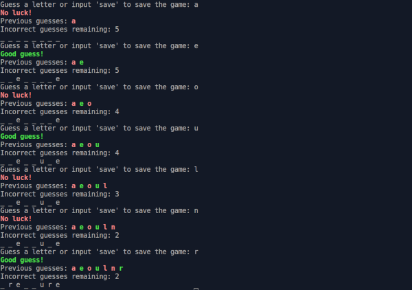

# Hangman

## Project info

The command line Hangman game. The purpose of this project was to practice implementation of serialization with the save game feature.

Project description can be found [here](https://www.theodinproject.com/lessons/ruby-hangman).

## Live demo

Live demo available [on Replit (account required)](https://replit.com/@jcampbell57/Hangman)

## Table of Contents

* [Technologies utilized](#technologies-utilized)
* [Learning outcomes](#learning-outcomes)
* [Project screenshot](#project-screenshot)
* [Behind the Scenes](#behind-the-scenes)
* [Installation](#installation)

## Technologies utilized

- Ruby
- YAML

## Learning outcomes

This project helped to reinforce the following skills:

- implementation of game saves through serialization
- Object Oriented Programming (OOP)
- basic Ruby knowledge

## Project screenshot

## Behind the scenes

### Todo

- add color feature to v2.
- remove v1

## Installation

- Clone this repository to your desktop.
- Navigate to the top level of the directory by running `cd hangman`.
- Run `ruby main.rb` in your terminal.
